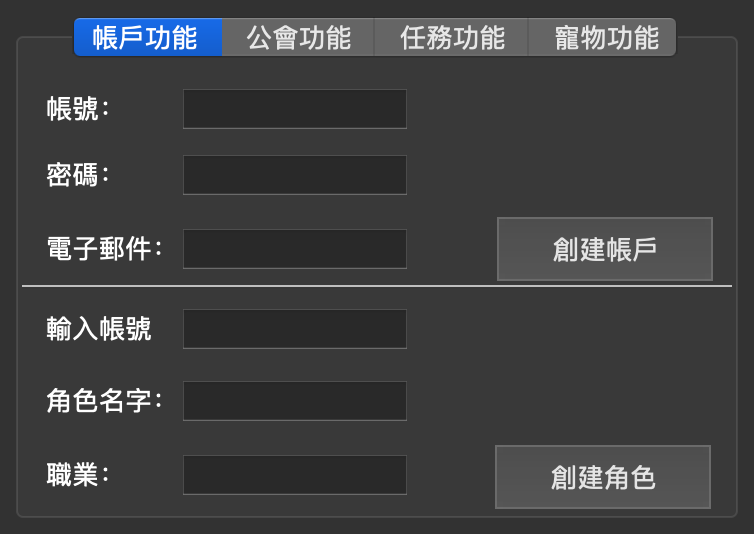

# DBMS FINAL PROJECT
contributed by <`徐郁淞 P76091543`>

## 目標：
* 學習使用SQL指令
* 使用現成資料庫(MySQL, …)，開發一個簡易且人性化的DBMS
  * (如：人事薪資系統、學生學籍系統、醫療管理系統、圖書管理系統……可自行發揮)
* 分組
  * 一人一組

## 實作軟體說明
* 系統介面(GUI): `PyQt`
* 系統資料庫：`MySQL`
* 實作語言：`python`

## 介面說明


### 帳戶功能
<p align="center">

</p>
**創建帳戶**
* BUTTON
  * 輸入帳號
  * 輸入密碼
  * 輸入電子郵件
  * 點擊右方`創建帳戶`按鈕

* QUERY
需替換[帳號], [密碼], [電子郵件]
(e.g. `'john_account'`, `'john_password'`, `'john@gmail.com'`)
```
INSERT INTO Account (Account_number, Password, Email) VALUES ([帳號], [密碼], [電子郵件])

// e.g. 
// INSERT INTO Account (Account_number, Password, Email) VALUES ('john_account', 'john_password', 'john@gmail.com')
```


**創建角色**
* BUTTON
  * 輸入帳號
  * 輸入角色名字
  * 輸入職業

* QUERY
需替換 `%s`
```
INSERT INTO  Role (Cname, Occupation, Speed, HP, MP, Power, Anumber, Gname) VALUES (%s, %s, %s, %s, %s, %s, %s, %s)

// e.g.
// INSERT INTO  Role (Cname, Occupation, Speed, HP, MP, Power, Anumber, Gname) VALUES ('john_role', 'worrier', '200', '300', '300', '400', 'john_account', 'noob')
```

### 公會功能
<p align="center">

</p>

**建立公會**
* BUTTON
  * 輸入角色名字
  * 輸入公會名稱
  * 輸入公會地址
  * 點擊右方`建立公會`

* QUERY
需替換 [公會名稱], [公會地址], [公會等級],[角色名字]
(e.g. `'noob_guild'`, `'green_island'`, `'1'`, `'john'`)

```
INSERT INTO Guild (Gname, Address, Level, Cname) VALUES ([公會名稱], [公會地址], [公會等級],[角色名字])

// e.g.
// INSERT INTO Guild (Gname, Address, Level, Cname) VALUES ('noob_guild', 'green_island', '1', 'john')
```


**加入公會**
* BUTTON
  * 輸入角色名字
  * 輸入公會名稱
  * 點擊右方`加入公會`

* QUERY
需替換 [公會名字]、[角色名字]
(e.g. `'noob_guild'`, `john`)

```
UPDATA Role SET Gname=[公會名字] WHERE Cname=[角色名字]

// e.g.
// UPDATA Role SET Gname='noob_guild' WHERE Cname='john'
```

**查看公會**
* BUTTON
  * 輸入角色名字
  * 輸入公會名稱
  * 點擊右方`查看公會`

* QUERY
需替換[角色名字]
(e.g. 'john')
```
SELECT * FROM Guild WHERE Cname = [角色名字]

// e.g.
// SELECT * FROM Guild WHERE Cname = [角色名字]
// 
```

### 任務功能
<p align="center">

</p>

**建立任務**
* BUTTON
  * 輸入角色名字
  * 輸入任務名稱
  * 點擊右方`建立任務`

* QUERY
需替換 `%s`

```
INSERT INTO Task (Tname, Reward, Cname) VALUES (%s, %s, %s)

// e.g.
// INSERT INTO Task (Tname, Reward, Cname) VALUES ('travel_task', '100', 'john')
```

**查看任務**
* BUTTON
  * 輸入角色名字
  * 點擊右方`查看任務`

* QUERY
需替換[角色名字]
e.g.('john')

```
SELECT * FROM Task WHERE Cname = [角色名字]

// e.g.
// SELECT * FROM Task WHERE Cname = 'john'
```

## 寵物功能
<p align="center">

</p>

**豢養寵物**
* BUTTON
  * 輸入角色名字
  * 寵物名字
  * 點擊右方`豢養寵物`

* QUERY
需替換 `%s`

```
INSERT INTO Pet (Pname, Hungry, Cname) VALUES (%s, %s, %s)

// e.g.
// INSERT INTO Pet (Pname, Hungry, Cname) VALUES ('john_pet', '100', 'john')
```

**查看寵物**
* BUTTON
  * 輸入角色名字
  * 點擊右方`查看寵物`

* QUERY
需替換[寵物名字]
e.g.('john')

```
SELECT * FROM Pet WHERE Cname = [寵物名字]

// e.g.
// SELECT * FROM Pet WHERE Cname = 'john'
```